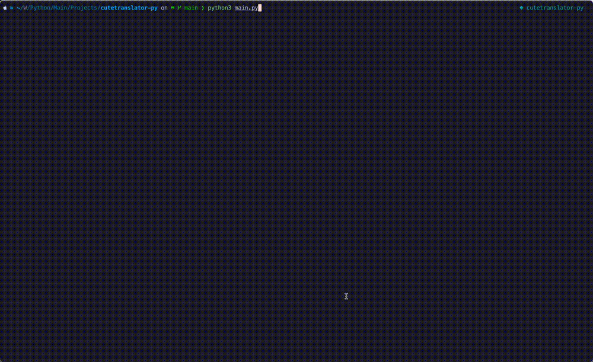

# Cute Translator

Cute Translator is a cli app built in python that allows you to translate text using the M2M100 translation model.

## Features
- it cool
- it look good
- language translation

## Installation

1. Clone the repo:


2. Create a virtual environment:
   ```
   python3 -m venv env
   source env/bin/activate
   ```

3. Install the packages:
   ```
   pip3 install -r requirements.txt
   ```

## Usage



How to run this (you should already know):

1. Ensure you're in the project directory and your virtual environment is activated (if you're using one).

2. Run the main script:
   ```
   python main.py
   ```

3. Follow the prompts:
   - Enter source language
   - Enter destination language(s) (separate multiple languages with commas)
   - Enter the text you wish to translate

4. Boom translations 🤯

## Supported Languages

- English
- Spanish
- French
- German
- Italian
- Portuguese
- Russian
- Chinese
- Japanese
- Hebrew
- Arabic
- Hindi
- Bengali
- Punjabi
- Malayalam
- Tamil
- Korean
- Dutch
- Turkish
- Polish
- Swedish
- Danish
- Norwegian
- Finnish
- Greek
- Thai
- Vietnamese
- Indonesian
- Malay

## Running Tests

To run the unit tests:

```
python -m unittest test.test_translator
```
